# MCP Dev Orchestrator System Architecture

## Overview

The **MCP Dev Orchestrator** is a production-ready MCP server that implements an intelligent multi-agent system to fully automate the software development lifecycle following the KILO CODE methodology and BMAD (Business, Models, Actions, Deliverables) framework.

## High-Level Architecture Diagram


## Component Architecture

### 1. Core Engine

#### Orchestrator Engine (`src/core/orchestrator.ts`)
- **Responsibility**: Main engine coordinating the entire BMAD workflow
- **Key Features**:
  - Complete pipeline lifecycle management
  - Inter-agent coordination
  - Global context management
  - Intelligent routing decisions
  - Error recovery and retry logic
  - Performance monitoring

#### Pipeline Manager (`src/core/pipeline.ts`)
- **Responsibility**: Multi-agent flow management
- **Key Features**:
  - Sequential and parallel task execution
  - Phase dependency management
  - Rollback and recovery handling
  - Pipeline metrics and telemetry
  - Dynamic task scheduling
  - Resource allocation

#### State Machine (`src/core/state-machine.ts`)
- **Responsibility**: FSM for phase transitions
- **Primary States**:
  ```
  IDLE → INITIALIZING → PLANNING → ARCHITECTING → DEVELOPING → TESTING → DEBUGGING → DEPLOYING → COMPLETED
         ↓                                                                                              ↓
         └──────────────────────────── FAILED ←──────────────────────────────────────────────────────┘
  ```
- **Transition Types**:
  - Forward: Normal pipeline progression
  - Backward: Rollback on errors
  - Skip: Bypass optional phases
  - Restart: Resume from checkpoint
  - Cancel: Abort pipeline execution

#### Checkpoint Manager (`src/core/checkpoint.ts`)
- **Responsibility**: State persistence and recovery
- **Features**:
  - Automatic checkpoint creation
  - Compression and encryption
  - Rotation policies
  - Fast recovery mechanisms
  - Checkpoint validation

### 2. Agent Roles

#### Architect Agent (`src/roles/architect/`)

- **Tools Used**: Sequential Thinking MCP, Memory MCP
- **Artifacts**: PLAN.md, ARCH.md, DECISIONS.md, TASKPLAN.md
- **Capabilities**:
  - Requirements analysis
  - System architecture design
  - Technology selection
  - Task decomposition
  - Risk assessment

#### Developer Agent (`src/roles/developer/`)

- **Tools Used**: GitHub MCP, File System, Memory MCP
- **Artifacts**: Source code, Unit tests, Documentation
- **Capabilities**:
  - Multi-language code generation
  - Test-driven development
  - Code refactoring
  - Documentation generation
  - Dependency management

#### Tester Agent (`src/roles/tester/`)

- **Tools Used**: Playwright MCP, Testing Frameworks
- **Artifacts**: TEST-REPORT.md, Coverage reports, Screenshots
- **Capabilities**:
  - Test generation
  - Test execution
  - Coverage analysis
  - Performance testing
  - Security scanning

#### Debugger Agent (`src/roles/debugger/`)

- **Tools Used**: BMAD MCP, Memory MCP, GitHub MCP
- **Artifacts**: DEBUG-LOG.md, Fix commits, Performance reports
- **Capabilities**:
  - Error analysis
  - Root cause identification
  - Automated fixing
  - Performance optimization
  - Security patching

### 3. MCP Interface Layer

#### Tools API (`src/tools/`)
```typescript
interface MCPTool {
  name: string;
  description: string;
  inputSchema: ZodSchema;
  outputSchema: ZodSchema;
  handler: (input: unknown) => Promise<ToolResult>;
  metadata: ToolMetadata;
}
```

**Implemented Tools**:
| Tool | Description | Complexity |
|------|-------------|------------|
| `orchestrator.run` | Complete BMAD pipeline execution | High |
| `architect.plan` | Architecture and planning | High |
| `developer.implement` | Incremental implementation | Medium |
| `tester.validate` | Comprehensive validation | Medium |
| `debugger.fix` | RCA and correction | High |

#### Resources API (`src/resources/`)
```typescript
interface MCPResource {
  uri: string;
  name: string;
  description: string;
  mimeType: string;
  handler: () => Promise<ResourceContent>;
  metadata: ResourceMetadata;
}
```

**Exposed Resources**:
| Resource URI | Content Type | Description |
|--------------|--------------|-------------|
| `orchestrator://state/project` | application/json | Current project state |
| `orchestrator://history/pipelines` | application/json | Pipeline execution history |
| `orchestrator://capabilities/agents` | application/json | Agent capabilities |
| `orchestrator://knowledge/graph` | application/json | Knowledge graph |
| `orchestrator://results/tests` | application/json | Test results |

#### Prompts API (`src/prompts/`)
```typescript
interface MCPPrompt {
  name: string;
  description: string;
  arguments: PromptArgument[];
  handler: (args: Record<string, unknown>) => Promise<PromptResult>;
  metadata: PromptMetadata;
}
```

**Available Prompts**:
| Prompt | Purpose | Parameters |
|--------|---------|------------|
| `/kickoff` | Start complete pipeline | `{objective, mode}` |
| `/hand_off` | Delegate to specific role | `{role, context}` |
| `/status` | Get current pipeline status | `{}` |
| `/resume` | Resume from checkpoint | `{checkpointId, strategy}` |

### 4. Adapters Layer

Each adapter implements the common interface:
```typescript
interface MCPAdapter<T = any> {
  name: string;
  connect(): Promise<void>;
  disconnect(): Promise<void>;
  execute<R>(operation: string, params: T): Promise<R>;
  getCapabilities(): AdapterCapabilities;
  healthCheck(): Promise<boolean>;
}
```

#### Adapter Implementations

| Adapter | Purpose | Key Operations |
|---------|---------|----------------|
| **GitHub** | Repository management | Commits, PRs, Branches |
| **Memory** | State persistence | Store, Retrieve, Search |
| **Sequential** | Structured planning | Decompose, Analyze, Plan |
| **Playwright** | Browser automation | Test, Screenshot, Record |
| **BMAD** | Methodology implementation | Measure, Analyze, Deploy |

## Data Flow

### Main BMAD Pipeline Flow


### Error Recovery Flow


### Agent Communication Pattern

```mermaid
graph LR
    subgraph "Message Bus"
        MB[Event Bus]
    end
    
    subgraph "Agents"
        A1[Architect]
        A2[Developer]
        A3[Tester]
        A4[Debugger]
    end
    
    subgraph "Events"
        E1[TaskComplete]
        E2[ErrorDetected]
        E3[PhaseComplete]
        E4[StateChange]
    end
    
    A1 --> MB
    A2 --> MB
    A3 --> MB
    A4 --> MB
    
    MB --> E1
    MB --> E2
    MB --> E3
    MB --> E4
    
    E1 --> A1
    E1 --> A2
    E2 --> A4
    E3 --> A1
    E4 --> A1
```



## Design Patterns Applied

### 1. Chain of Responsibility
- Pipeline of agents where each handles its specific phase
- Allows dynamic addition/removal of agents
- Enables flexible workflow customization

### 2. State Pattern
- FSM for managing phase transitions
- Well-defined states with controlled transitions
- Predictable behavior and easy debugging

### 3. Strategy Pattern
- Different execution strategies based on context
- Switchable between sequential/parallel modes
- Customizable per phase or task

### 4. Observer Pattern
- Event-driven communication between components
- Real-time UI updates
- Decoupled component interaction

### 5. Adapter Pattern
- Uniform integration with external MCPs
- Abstraction of specific implementations
- Easy addition of new integrations

### 6. Command Pattern
- Encapsulation of operations as objects
- Support for undo/redo and replay
- Audit trail and debugging

### 7. Factory Pattern
- Dynamic agent creation based on configuration
- Flexible instantiation of adapters
- Plugin architecture support

### 8. Repository Pattern
- Abstraction of data persistence
- Consistent data access interface
- Support for multiple storage backends

## Key Architecture Decisions

### 1. Multi-Agent Architecture
- **Decision**: Specialized agent system vs monolithic
- **Rationale**: Better modularity, specialization, and maintainability
- **Trade-offs**: Increased coordination complexity
- **Mitigation**: Central orchestrator and state machine

### 2. Event-Driven with FSM
- **Decision**: State Machine for flow control
- **Rationale**: Predictable transitions and robust recovery
- **Trade-offs**: Rigidity in unforeseen flows
- **Mitigation**: Extensible state definitions

### 3. Adapter Pattern for MCPs
- **Decision**: Abstraction layer over external MCPs
- **Rationale**: Decoupling and testability
- **Trade-offs**: Abstraction overhead
- **Mitigation**: Efficient caching and lazy loading

### 4. Local Checkpointing
- **Decision**: Checkpoint system in `.kilo/` directory
- **Rationale**: Fast recovery and debugging
- **Trade-offs**: Local disk usage
- **Mitigation**: Rotation policies and compression

### 5. TypeScript with Strict Mode
- **Decision**: TypeScript over JavaScript
- **Rationale**: Type safety and better IDE support
- **Trade-offs**: Compilation step required
- **Mitigation**: Fast build tools (tsup, esbuild)

## Scalability Strategy

### Horizontal Scaling
- Multiple agent instances per type
- Load distribution by project
- Queue management for tasks
- Distributed checkpointing
- Shared knowledge graph

### Vertical Scaling
- Memory optimization with streaming
- Lazy loading of resources
- Intelligent caching strategies
- Connection pooling
- Resource limits per agent

### Performance Optimizations
- Parallel task execution where possible
- Incremental processing
- Result caching
- Compression for storage
- Efficient data structures

## Security Considerations

### Authentication & Authorization
- Token-based authentication for MCPs
- Role-based access control (RBAC)
- API key management
- Session management
- Audit logging

### Isolation & Sandboxing
- Code execution sandboxing
- Resource limits per agent
- Network isolation
- Filesystem restrictions
- Process isolation

### Data Protection
- Checkpoint encryption
- Log sanitization
- Secure secret management
- TLS for communications
- Input validation

### Security Best Practices
- Regular dependency updates
- Security scanning in CI/CD
- Penetration testing
- Vulnerability disclosure policy
- Security incident response plan

## Monitoring & Observability

### Key Metrics
| Metric | Description | Alert Threshold |
|--------|-------------|-----------------|
| Pipeline completion rate | Success percentage | < 90% |
| Average task duration | Time per task | > 5 min |
| Error rate per agent | Agent failures | > 5% |
| Resource utilization | CPU/Memory usage | > 80% |
| API response time | Latency | > 1s |

### Logging Strategy
- Structured logging with Pino
- Log levels: debug, info, warn, error, fatal
- Correlation IDs for traceability
- Log aggregation and analysis
- Retention policies

### Telemetry
- OpenTelemetry integration
- Distributed tracing
- Custom metrics per phase
- Performance profiling
- Real-time dashboards

### Health Checks
- Liveness probes
- Readiness probes
- Dependency health checks
- Circuit breaker status
- Resource availability

## Testing Strategy

### Test Pyramid
```
         /\
        /E2E\        5%
       /------\
      /Integration\  15%
     /------------\
    /   Unit Tests  \ 80%
   /----------------\
```

### Test Coverage Requirements
- Unit Tests: > 80% coverage
- Integration Tests: Critical paths
- E2E Tests: Happy paths
- Performance Tests: Load scenarios
- Security Tests: OWASP Top 10

## Deployment Architecture

### Container Strategy
```yaml
services:
  orchestrator:
    image: mcp-orchestrator:latest
    ports: [3001]
    volumes: [./data:/data]
    
  redis:
    image: redis:alpine
    ports: [6379]
    
  postgres:
    image: postgres:14
    ports: [5432]
    environment:
      POSTGRES_DB: orchestrator
```

### Kubernetes Deployment
- Horizontal Pod Autoscaling
- ConfigMaps for configuration
- Secrets for sensitive data
- Persistent Volume Claims
- Service mesh integration

## Future Architecture Considerations

### Near-term (v1.1-1.5)
- GraphQL API layer
- WebSocket real-time updates
- Plugin architecture
- Multi-tenancy support
- Cloud-native deployment

### Long-term (v2.0+)
- Microservices decomposition
- Event sourcing
- CQRS pattern
- Federated learning
- Quantum-ready algorithms

## Conclusion

This architecture provides:
- ✅ Robust and scalable system
- ✅ Clear separation of concerns
- ✅ Comprehensive error recovery
- ✅ Extensibility for new agents
- ✅ Seamless MCP integration
- ✅ Complete pipeline observability
- ✅ Production-ready security
- ✅ Performance optimization
- ✅ Future-proof design

---

*For implementation details, see the [Developer Guide](./DEVELOPER-GUIDE.md)*
*For configuration options, see the [Configuration Guide](./CONFIGURATION.md)*